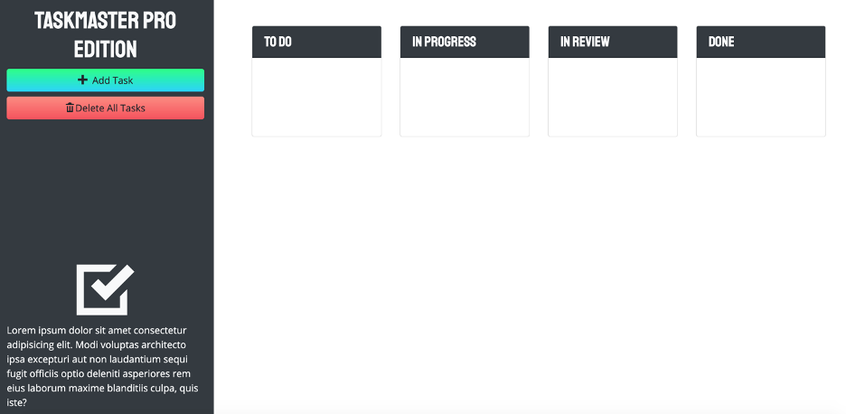

# Taskmaster-Pro

## Functionality
Create To-do lists in a kanban style that allows you to update the status to in-progress, in-review and done. Your tasks will be draggable between columns. You will be given a visual notice if upcoming To-do's are nearing their due date.

## Languages
HTML, CSS, JavaScript. All dynamically created with third-party APIs.

## Libraries used
JQuery, JQuery UI, Moment.js, Bootstrap, Iconic, JQuery UI Touch Punch

## Credits
Created by UofA Coding Bootcamp and deployed by Brandi Curley

## Link to webpage:
https://galacticnative.github.io/taskmaster-pro/

